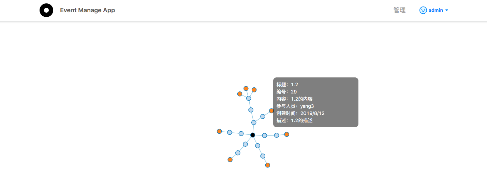
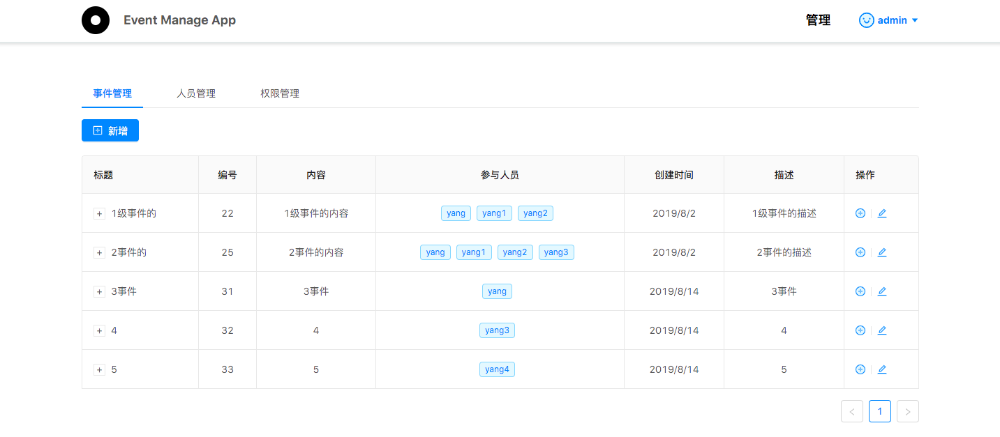
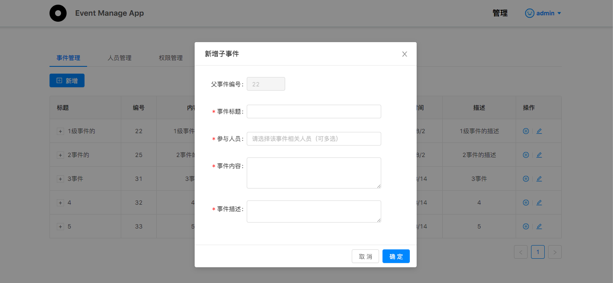

# web 全栈项目

## 项目介绍

项目含有登录注册功能，管理事件和人员等接口，并用 d3 做了一个树形的热力图可视化 

前端基于 react，后端基于 koa 的一个全栈项目，主要用于自己学习成长，目前社区有很多优秀的项目工程框架，希望自己可以通过一步步的迭代，将本项目一步步完善到可以用于生产环境的项目，而不仅仅是一个简单的 demo，目标包括但不限于：在原始基础上增加，redux 状态管理，优化 react-router，登录鉴权，使用高阶组件，二次封装 ant-design 组件，统一处理 ajax 错误提示，优化 axios 请求，代码分片，增加字体图标；后端优化表结构，优化 ORM 框架使用，密码存储加密，数据库提交事务，学习 egg.js 增加 service 层... 

  

## v_0.0 原始版本

前端使用 create-react-app 脚手架创建 client 端项目

1. react
2. react-router-dom
3. ant-design
4. d3

后端使用 koa 框架搭建

1. koa
2. mysql
3. sequelize
4. kwt

下个版本优化目标：

1. 增加状态管理
2. 路由登录鉴权，目前实现较 low，都是在 componentDidMount 里请求接口

## v_0.1 版本

更新记录

1. 增加 redux 状态管理
2. 优化路由鉴权，根据登录状态及登录后用户的权限，在路由层做鉴权及跳转控制。

下个版本优化目标：

1. 路由级的组件懒加载
2. 统一处理 axios 请求 url 前缀
3. 增加请求接口错误公共组件
